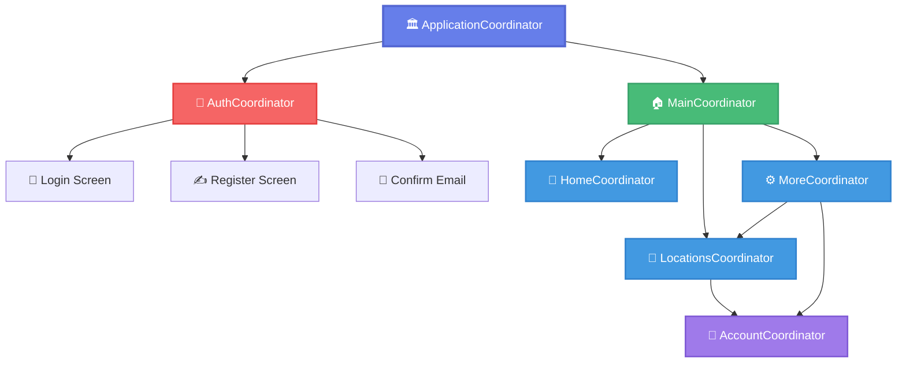

<div align="center">

# 🧭 Advanced SwiftUI UIKit Navigation Template

### A production-ready iOS starter template with enterprise-grade navigation architecture

[](https://swift.org)
[](https://developer.apple.com/ios/)
[](LICENSE)
[](https://www.apple.com/ios/)
[]()
[]()
[]()


</div>

---

## 📋 Table of Contents

- [✨ Features](#-features)
- [🏗️ Architecture](#️-architecture)
- [📂 Project Structure](#-project-structure)
- [🚀 Getting Started](#-getting-started)
- [📱 Navigation Patterns](#-navigation-patterns)
- [🎯 Use Cases](#-use-cases)
- [📚 Documentation](#-documentation)
- [🤝 Contributing](#-contributing)

---

## 🎬 Live Demo

**Want to see this template in action?** Check out our fully-functional electronics shop demo!

🛍️ **[View Demo Branch](https://github.com/mohamed00736/NavStarterTemplate/tree/demo/electronics-shop)** - Complete e-commerce app with:
- 12+ mock products with beautiful UI
- Shopping cart functionality  
- Category filtering & search
- Product details with specifications
- Modern gradients & animations
- Real-world navigation flows

```bash
# Try the demo yourself
git checkout demo/electronics-shop
```

---

## ✨ Features

<table>
<tr>
<td width="50%">

### 🎯 Core Features
- ✅ **Coordinator Pattern** - Enterprise-grade navigation
- ✅ **MVVM Architecture** - Clean separation of concerns
- ✅ **SwiftUI + UIKit** - Best of both worlds
- ✅ **Protocol-Based** - Highly decoupled & testable
- ✅ **Memory Safe** - Proper lifecycle management

</td>
<td width="50%">

### 🔥 Advanced Features
- ✅ **Tab Navigation** - Multi-tab with deep linking
- ✅ **Modal & Push** - Flexible presentation styles
- ✅ **Nested Flows** - Complex navigation hierarchies
- ✅ **Auth Flow** - Complete login/register system
- ✅ **Reusable Components** - DRY principle throughout

</td>
</tr>
</table>

---

## 🏗️ Architecture

<div align="center">

### Coordinator Pattern Hierarchy



</div>

### 🎨 Key Components

| Component | Description | Icon |
|-----------|-------------|------|
| **BaseCoordinator** | Generic coordinator base with child management | 🏗️ |
| **HostingController** | SwiftUI ↔ UIKit bridge | 🌉 |
| **BaseViewModel** | View model with hosting controller reference | 📦 |
| **ModelLayer** | Three-tier data architecture | 🗄️ |
| **Navigation Protocols** | Decoupled navigation delegates | 🔌 |

---

## 📂 Project Structure

```
🗂️ Advanced SwiftUI UIKit Nav/
│
├── 🎛️ Configuration/          # App configuration and setup
│   └── AppConfiguration.swift
│
├── 🧭 Coordinators/           # Navigation coordinators
│   ├── ApplicationCoordinator.swift
│   ├── 📦 Flows/
│   │   ├── AuthCoordinator.swift
│   │   ├── MainCoordinator.swift
│   │   ├── AccountCoordinator.swift
│   │   ├── 🎯 Tab Flows/
│   │   │   ├── HomeCoordinator.swift
│   │   │   ├── LocationsCoordinator.swift
│   │   │   └── MoreCoordinator.swift
│   │   └── 🔧 Supporting/
│   │       ├── ConfirmEmailCoordinating.swift
│   │       └── UpgradeCoordinating.swift
│   └── 🛠️ Supporting/
│       └── BaseCoordinator.swift
│
├── ⚙️ Core/                   # Core utilities
│   ├── HostingController.swift
│   └── BaseViewModel.swift
│
├── 🗃️ ModelLayer/             # Data & system layers
│   ├── ModelLayer.swift
│   ├── 💾 Data Layer/
│   │   ├── Database.swift
│   │   └── DataLayer.swift
│   └── 🖥️ System Layer/
│       ├── SystemLayer.swift
│       └── UserDefaultsManager.swift
│
├── 📱 Screens/                # SwiftUI views & ViewModels
│   ├── 🔐 Login/
│   ├── ✍️ Register/
│   ├── 👤 Account Screens/
│   ├── 🏡 Home/
│   ├── 📍 Locations/
│   ├── ⚙️ More/
│   ├── 📧 Confirm Email/
│   └── 👑 Upgrade/
│
├── 🎨 Shared Views/           # Reusable UI components
│   ├── BackgroundView.swift
│   ├── EmailField.swift
│   ├── PasswordField.swift
│   ├── ListRow.swift
│   └── 🎭 TextField Styles/
│
└── 🔌 Extensions/             # Helper extensions
    ├── NotificationNameExtensions.swift
    └── UIViewControllerExtensions.swift
```

---

## 🚀 Getting Started

### Prerequisites

```swift
• Xcode 14.0+
• iOS 15.0+
• Swift 5.7+
• macOS 12.0+ (for development)
```

### Quick Start

1️⃣ **Use this template**
   - Click the green **"Use this template"** button at the top
   - Name your new project
   - Clone your new repository

2️⃣ **Open in Xcode**
   ```bash
   cd YourProjectName
   open "Advanced SwiftUI UIKit Nav.xcodeproj"
   ```

3️⃣ **Build and Run**
   - Select a simulator or device
   - Press `⌘ + R`
   - Start exploring! 🎉

### First Steps

🔹 Check out `ApplicationCoordinator.swift` - The navigation entry point  
🔹 Explore `BaseCoordinator.swift` - Core navigation logic  
🔹 Review `LoginView.swift` - Example of View + ViewModel pattern  
🔹 Understand `AuthCoordinator.swift` - Complete auth flow implementation  

---

## 📱 Navigation Patterns

### 🎯 Adding a New Screen

```swift
// 1. Create SwiftUI View with ViewModel
struct MyNewView: View {
    @StateObject var viewModel: ViewModel
    // View implementation
}

extension MyNewView {
    class ViewModel: BaseViewModel, ObservableObject {
        weak var navDelegate: MyNewNavDelegate?
        // ViewModel implementation
    }
}

// 2. Define navigation delegate
protocol MyNewNavDelegate: AnyObject {
    func onMyNewAction()
}

// 3. Implement in coordinator
extension MyCoordinator: MyNewNavDelegate {
    func showMyNewScreen() {
        let viewModel = MyNewView.ViewModel()
        viewModel.navDelegate = self
        let view = MyNewView(viewModel: viewModel)
        let controller = HostingController(rootView: view, viewModel: viewModel)
        presenter.pushViewController(controller, animated: true)
    }
    
    func onMyNewAction() {
        // Handle navigation
    }
}
```

### 🔄 Creating a New Flow

<details>
<summary><b>Click to expand</b></summary>

```swift
// 1. Create coordinator
class MyNewCoordinator: BaseCoordinator<UINavigationController> {
    weak var delegate: MyNewCoordinatorDelegate?
    
    override func start() {
        super.start()
        showFirstScreen()
    }
}

// 2. Define delegate
protocol MyNewCoordinatorDelegate: AnyObject {
    func onMyNewCoordinationComplete(coordinator: MyNewCoordinator)
}

// 3. Start from parent coordinator
func startMyNewFlow() {
    let coordinator = MyNewCoordinator(presenter: presenter, modelLayer: modelLayer)
    coordinator.delegate = self
    coordinator.start()
    store(coordinator: coordinator)
}
```

</details>

---

## 🎯 Use Cases

<table>
<tr>
<td width="33%" align="center">

### 🏢 Enterprise Apps
Perfect for large-scale apps with complex navigation requirements

</td>
<td width="33%" align="center">

### 🎓 Learning Projects
Great example of production-ready architecture patterns

</td>
<td width="33%" align="center">

### 🚀 MVP Development
Quick starter for building proof-of-concepts

</td>
</tr>
</table>

---

## 📚 Documentation

### 🎓 Key Concepts

<details>
<summary><b>🧭 Coordinator Pattern</b></summary>

The Coordinator Pattern separates navigation logic from view controllers, making your code more:
- **Testable** - Mock coordinators for unit tests
- **Reusable** - Share navigation logic across flows
- **Maintainable** - Centralized navigation in one place
- **Scalable** - Easy to add new flows

</details>

<details>
<summary><b>🌉 SwiftUI + UIKit Bridge</b></summary>

`HostingController` bridges SwiftUI and UIKit:
```swift
class HostingController<Content: View, VM: BaseViewModel>: UIHostingController<Content> {
    var viewModel: VM
    // Bidirectional communication enabled
}
```

This allows:
- SwiftUI views in UIKit navigation
- Access to navigation controller from SwiftUI
- Custom back buttons and navigation items

</details>

<details>
<summary><b>🔌 Protocol-Based Navigation</b></summary>

Navigation delegates decouple views from navigation:
- Views don't import coordinators
- Easy to mock for testing
- Clear navigation contracts
- Reusable across different flows

</details>

---

## 🎨 Customization

### 🎭 Theming
Customize colors, fonts, and styles in `Shared Views/`

### 🗄️ Data Layer
Add your networking, database, or persistence in `ModelLayer/`

### 🔐 Authentication
Modify auth flow in `AuthCoordinator.swift` and related views

### 🧩 Add Dependencies
Initialize third-party libraries in `AppConfiguration.swift`

---

## 🛠️ Advanced Features

### 💡 Protocol Composition

Reusable coordinator functionality through protocols:

```swift
protocol UpgradeCoordinating: BaseCoordinator<UINavigationController> {
    func showUpgradeScreen()
}

// Any coordinator can conform to show upgrade screen
extension LocationsCoordinator: UpgradeCoordinating {}
extension MoreCoordinator: UpgradeCoordinating {}
```

### 🔔 Global Events

NotificationCenter for app-wide events:

```swift
// Logout from anywhere in the app
NotificationCenter.default.post(name: .logout, object: nil)

// ApplicationCoordinator handles cleanup and navigation
```

### 🧠 Smart Navigation

Automatic handling of embedded vs. modal presentation:

```swift
func pushControllerBasedOnEmbeddedNavState(controller: UIViewController) {
    if embeddedInExistingNavStack {
        navController.pushViewController(controller, animated: true)
    } else {
        navController.setViewControllers([controller], animated: false)
    }
}
```

---

## 🤝 Contributing

Contributions are welcome! Feel free to:
- 🐛 Report bugs
- 💡 Suggest new features
- 📝 Improve documentation
- 🔧 Submit pull requests

---

## 📄 License

This template is free to use for any purpose, commercial or personal.

---

## 🌟 Star History

If you find this template helpful, please consider giving it a ⭐️!

---

<div align="center">

### 👨‍💻 Created by Robert Barber

**Made with ❤️ for the iOS community**

[](https://github.com/mohamed00736)

---

**Happy Coding! 🚀**

</div>
